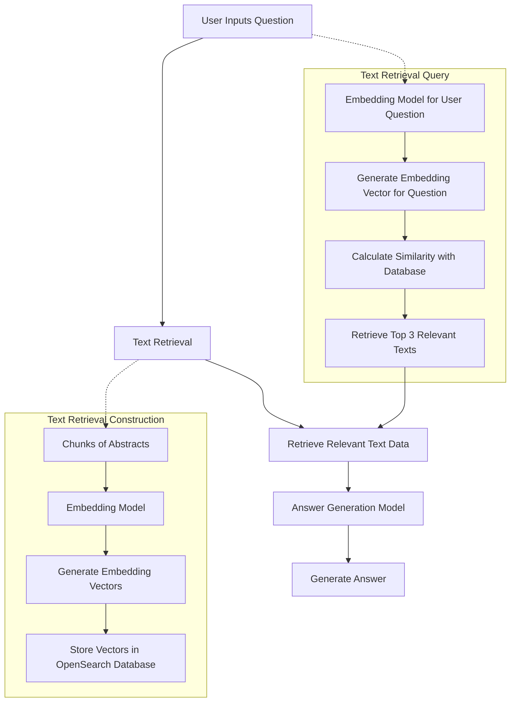

# QAsystem-NLPT
Natural Language Processing with Transformers Project

## Key Information
+ **Title:** QAsystem-NLPT (TBD)
  
+ **Team Members:** \
Guangdeng Liang, 3769325, Data and computer science (GitHub: Gorden-GitHub)\
Ye Tao, \
Yong Wu, \
Ziwei Liu

+ **Mail Addresses:**\
guangdeng.liang@stud.uni-heidelberg.de \

+ **Member Contribution:** 
  - Guangdeng Liang
    - text_retrieval, data preprocessing
  - Ye Tao 
  - Yong Wu 
  - Ziwei Liu

+ **Advisor:** \
Satya Almasian

+ **Anti-plagiarism Confirmation:** 

## Introduction

## Related Work

## Methods/Approach
### Data Acquisition
For the "Data Acquisition" phase of our project, we adhered closely to the guidelines provided in the project documentation regarding data selection. Our team elected to focus on PubMed as our primary source of data. Specifically, we targeted abstracts from articles published between 2013 and 2023 that include the term "intelligence" within the abstract text. This decision aligns with our project's domain of interest and sets a clear foundation for our research objectives.

To efficiently gather the required data, we utilized [Entrez Direct](https://www.ncbi.nlm.nih.gov/books/NBK179288/), a tool recommended by PubMed. Entrez Direct offers a command-line interface for accessing NCBI's comprehensive databases, allowing us to precisely retrieve the needed abstracts. This method ensures a streamlined and effective data collection process, pivotal for the success of our subsequent analyses.

### Workflow

### Chunking Methods
For effective processing and analysis of text data within our project, implementing an efficient chunking method is essential. One significant consideration is that some embedding models and answer generation models impose restrictions on the maximum number of input tokens they can handle. This limitation necessitates the division of text into smaller, manageable pieces or "chunks" to ensure compatibility with these models' input constraints. Chunking, therefore, becomes not just a matter of processing efficiency but also a fundamental requirement for the operational feasibility of our models.  

To address this, we have opted to utilize the `NLTKTextSplitter` from the `langchain.text_splitter` package, chosen for its robustness and its ability to accurately segment text based on natural language cues, ensuring that each chunk adheres to the models' input token limits while maintaining coherent and contextually meaningful segments of text. This splitter leverages the Natural Language Toolkit (NLTK), a leading platform for building Python programs to work with human language data, which provides powerful linguistic processing capabilities.

### Embedding Model
In our pursuit of a highly efficient and effective embedding model for our text processing pipeline, we carefully reviewed various options presented in the [rag.pdf](https://moodle.uni-heidelberg.de/pluginfile.php/1371515/mod_resource/content/2/rag.pdf), particularly focusing on the recommendations provided on [Hugging Face's MTEB leaderboard](https://huggingface.co/spaces/mteb/leaderboard). After thorough consideration, we decided to adopt the UAE-Large-V1 model as our primary embedding model.

Our selection of the UAE-Large-V1 model as the embedding model for our project was principally guided by its high ranking on Hugging Face's MTEB leaderboard. The leaderboard showcases a comprehensive evaluation of various models based on their performance across multiple text embedding benchmarks. The UAE-Large-V1 model's superior position indicates its exceptional capability in generating robust and versatile embeddings, making it a highly suitable choice for our project's intricate requirements in text retrieval and analysis. This empirical evidence of the model's effectiveness, as demonstrated in a competitive and diverse testing environment, solidified our decision to incorporate it into our text processing pipeline.

Given the specific nature of our project's domain, fine-tuning the UAE-Large-V1 model on our dataset is a crucial step. This process involves adjusting the model's parameters to better align with the semantic and contextual nuances of our collected text data, particularly the abstracts sourced from PubMed that contain the keyword "intelligence." Fine-tuning ensures that the model's embeddings are highly relevant and optimized for our text corpus, thereby enhancing the accuracy and relevance of the text retrieval and answer generation components of our system.

### Vector Database
For the storage, management, and retrieval of embedding vectors generated by the UAE-Large-V1 model, our team has chosen OpenSearch as our vector database solution. OpenSearch, a community-driven, open-source search and analytics suite, offers robust capabilities for handling large-scale vector data, making it an ideal choice for our project's needs.

### Text Retrieval Evaluation for Semantic Search
Mean Reciprocal Rank (MRR). The Mean Reciprocal Rank is a statistic measure used to evaluate the performance of information retrieval systems, particularly useful in scenarios where each query has a single relevant document. MRR calculates the average of the reciprocal ranks of the relevant documents for a set of queries. The rank of a document is determined by its position in the list of retrieved documents when ordered by descending relevance to the query.  

MRR Calculation  
The MRR is computed as follows:  
$MRR = \frac{1}{|Q|} \sum_{i=1}^{|Q|} \frac{1}{\text{rank}_i}$  
​where $|Q|$ is the number of queries in the test set, and $\text{rank}_i$ is the rank position of the first relevant document for the $i^{th}$ query. If the relevant document does not appear in the retrieved list, the reciprocal rank is set to 0.

## Experimental Setup and Results

### Data
This project leverages diverse datasets to fulfill various requirements, including initial data acquisition, model fine-tuning, and balabala!!!!!. Each dataset undergoes a series of preprocessing steps to ensure its quality and compatibility with our analytical methods. Below, we describe each dataset in detail, outlining their sources, collection methods, and the preprocessing steps applied.

#### 1.Abstracts Dataset
- **Purpose**: Serves as the foundational corpus for the entire project.
- **Description**: Comprises abstracts from articles published between 2013 and 2023 that include the term "intelligence" within the abstract text.
- **Source**: Retrieved from PubMed.
- **Collection Methods**: Utilized the Entrez Direct tool to efficiently query and download relevant abstracts based on specific search criteria, including date range and keyword occurrences. The detailed code and methodology employed for data collection are documented within the `PubMed_dataset` folder in our [GitHub repository](https://github.com/lingyoumax/QAsystem-NLPT-WS2023/tree/main/PubMed_dataset).
- **Preprocessing Steps**:
  - balabala!!!!!
  - **Removal of Rows with Missing Values**: Any rows in the CSV files containing missing or incomplete information were identified and removed to ensure the integrity and consistency of the dataset.
  - **Exclusion of Retracted Articles**: Articles that have been retracted were systematically identified and excluded from the dataset.
  - **Text Splitting**: Employed the `NLTKTextSplitter` from the `langchain.text_splitter` package to segment the abstracts into smaller, manageable chunks. This step is crucial for enhancing the processing efficiency and aligning with the input requirements of subsequent models.

#### 2. GPT-4 Generated Question-Answer Pairs (TBD Taoye)

#### 3. Fine-Tuning Dataset for Text Retrieval Model in Semantic Search
- **Purpose**: Used to fine-tune the embedding model for enhanced performance in text retrieval tasks within our project's specific domain.
- **Description**: This dataset is crafted by further processing the GPT-4 Generated Question-Answer Pairs, in alignment with the structured methodologies outlined in the [FlagEmbedding fine-tuning examples](https://github.com/FlagOpen/FlagEmbedding/tree/master/examples/finetune).
- **Source**: Derived from the GPT-4 Generated Question-Answer Pairs.
- **Collection Methods**:
  - **Methodological Alignment**: Followed the structured approach and best practices as recommended in the FlagEmbedding fine-tuning examples for processing and preparing the dataset.
  - **Extraction and Transformation**: Questions and answers were extracted from the GPT-4 generated pairs and transformed into a format suitable for embedding model training, including pairing questions with relevant text passages.
  - **Quality Filtering**: Employed a rigorous quality filtering process to ensure the inclusion of only high-quality, relevant question-answer pairs, maintaining the integrity of the model training process.
  - **Hard Negatives Mining**: Implemented the hard negatives mining technique as suggested in the FlagEmbedding examples. This method enhances the quality of sentence embeddings by identifying and incorporating challenging negative examples that are close to positive samples in the embedding space but are not relevant. This approach significantly improves the model's discrimination capabilities.
- **Preprocessing Steps**:
  - **Manual Filtering**: Conducted a general manual filtering of the GPT-4 Generated Question-Answer Pairs to remove those that did not meet our criteria for high quality and relevance. This process involved a broad review rather than an exhaustive examination of each pair, focusing on identifying and excluding obviously unsuitable content.
  - **Dataset Merging**: The GPT-4 Generated Question-Answer Pairs, which comprised only three columns (Question, Answer, and PMID), were merged with the unsplit Abstracts Dataset. This step was necessary because the text associated with each PMID in the question-answer pairs was in its original, unsplit form. By merging these datasets using PubMed IDs, we were able to link each question-answer pair with the full, corresponding abstract text from the Abstracts Dataset, providing a complete context for further processing and analysis.
  - **Text Splitting and Embedding**:
     - Employed `NLTKTextSplitter` from `langchain.text_splitter` to segment the merged abstract texts into smaller chunks.
     - Utilized [voyageai](https://docs.voyageai.com/embeddings/) to generate embedding vectors for each chunk and the questions.
     - Calculated cosine similarity between question vectors and chunk vectors to identify the top 3 most similar chunks for each question.
  - **Training Data Preparation**:
     - Formatted the fine-tuning dataset as a JSON file, where each line is a dictionary with the structure: `{"query": str, "pos": List[str], "neg":List[str]}`.
     - Here, `query` represents the question, `pos` includes the top 1 chunk (most similar to the question), and `neg` is a randomly chosen chunk from the remaining ones.
  - **Hard Negatives Mining**: Applied the hard negatives mining technique as outlined in the FlagEmbedding fine-tuning examples to further enhance the dataset's quality by incorporating challenging negative examples that closely resemble positive samples in the embedding space.
- **Relevant Code**: The code and scripts used for the preprocessing steps outlined above can be found in the [Fine-Tuning_Preprocessing folder](https://github.com/lingyoumax/QAsystem-NLPT-WS2023/tree/main/text_retrieval/semantic_search/semantic_search_gd/Fine-Tuning_Preprocessing) of our project's GitHub repository.

### Evaluation Method for Text Retrieval Model in Semantic Search

#### Evaluation Process

The evaluation of our Text Retrieval Model using the Mean Reciprocal Rank (MRR) involves the following steps, as reflected in our Python script:

1. **Data Preparation**:
   - The evaluation dataset was created during the preparation of the Fine-Tuning Dataset for the Text Retrieval Model. After completing the **Manual Filtering** step, a subset of the refined data was randomly sampled to serve as the basis for evaluation. Specifically, 1000 entries were selected using a fixed random seed to ensure consistency and reproducibility in the evaluation process. This sampled dataset contains queries along with the correct identifiers for the relevant documents, which are essential for calculating the Mean Reciprocal Rank (MRR).

2. **Model and Client Setup**:
   - Initialize the `FlagModel` with the specified model and query instruction settings for retrieval.
   - Configure the `OpenSearch` client with the necessary connection details, ensuring secure and authenticated access to our indexed data.

3. **Query Processing and Retrieval**:
   - For each query in the dataset:
     - Convert the query into an embedding using the `FlagModel.encode_queries` method.
     - Construct a search query to retrieve the top 5 most relevant documents from the OpenSearch index, ranked by cosine similarity to the query embedding.

4. **Rank Identification and MRR Calculation**:
   - Identify the rank of the correct document (as indicated by the PMID) within the retrieved results.
   - Calculate the reciprocal rank for each query; if the correct document is not retrieved, the reciprocal rank is considered 0.
   - Sum these reciprocal ranks and divide by the total number of queries to obtain the MRR.

5. **Result Analysis**:
   - Output the computed MRR value, providing a quantitative measure of the Text Retrieval Model's performance in accurately identifying relevant documents.

For a detailed view of the implementation and to access the evaluation script, please visit our [GitHub repository folder](https://github.com/lingyoumax/QAsystem-NLPT-WS2023/tree/main/text_retrieval/semantic_search/semantic_search_gd/evaluation). By meticulously following this process, we ensure a comprehensive and precise evaluation of our model's retrieval capabilities, enabling us to identify strengths and areas for improvement based on the MRR metric.

### Experimental Details for Text Retrieval Model in Semantic Search

Our experimental setup involves several key components and configurations, detailed below, to ensure the replicability of our results.

#### Model and Index Configuration

- **Model**: We used the `FlagModel` from the FlagEmbedding library with the model identifier `BAAI/bge-large-en-v1.5`. This model was selected for its robust performance in generating embeddings suitable for semantic search tasks.
  - **Query Instruction**: "Represent this sentence for searching relevant passages:" was used to guide the model in generating query-specific embeddings.
  - **Floating Point Precision**: We opted not to use FP16 (`use_fp16=False`) to prioritize the precision of embeddings over computation speed, given the critical nature of accuracy in our retrieval tasks.

#### OpenSearch Setup

- **Index Name**: Initially set as `abstracts_bge` and later as `abstracts_bge_fin1` post fine-tuning, to distinguish between the pre and post fine-tuned model states.
- **Connection**: Configured to connect to an OpenSearch instance hosted at `opensearch` on port `9200`, with standard authentication and SSL settings adapted for secure communication.

#### Data Indexing

- **Data Source**: The data was read from a CSV file named `splitted_pubmed_data_NLTK`, containing segmented abstracts alongside metadata such as PMIDs, publication dates, titles, and authors.
- **Mapping**: A specific mapping configuration was defined for the OpenSearch index to appropriately store various fields including `pmid`, `title`, `vector`, `publishedDate`, `authors`, `text_chunk_id`, and `arxiv_text`, with `vector` being stored as a `knn_vector` of dimension 1024 for similarity searches.
- **Indexing Process**: Each row from the dataframe was indexed into OpenSearch, with the text chunks encoded into embeddings using the `FlagModel.encode` method before indexing.

#### Fine-Tuning and Evaluation Data Preparation

- **Fine-Tuning Data**: The fine-tuning dataset was prepared and stored in a file named `qa_finetune_data_minedHN.jsonl`, adhering to a structured format suitable for training with negative samples mined for enhanced model performance.
- **Evaluation Data**: A subset of 1000 samples was selected from the fine-tuning dataset for evaluation purposes, ensuring a diverse range of queries for comprehensive model assessment.

#### Fine-Tuning Process

- The model was fine-tuned using a script that leverages PyTorch's distributed training capabilities. Key parameters included:
  - **Learning Rate**: Set to `1e-5`, a commonly used rate that balances convergence speed and stability.
  - **Batch Size**: A per-device train batch size of 4 was used, considering the balance between computational resource constraints and training efficiency.
  - **Epochs**: Training was conducted for 1 epoch to apply a moderate level of fine-tuning to the pre-trained embeddings.
  - **Max Token Lengths**: The maximum lengths for queries and passages were set to 120 and 408, respectively, to accommodate the typical length of inputs while respecting the model's capacity.
  - **Temperature**: Set to `0.02`, affecting the sharpness of the softmax distribution used in contrastive learning, with a lower temperature leading to a sharper distribution.

### Results for Text Retrieval Model in Semantic Search

Our project evaluates the effectiveness of a text retrieval model using the Mean Reciprocal Rank (MRR) metric, both before and after fine-tuning. The results are as follows:

- **Pre-trained Model MRR**: 0.7259
- **Fine-tuned Model MRR**: 0.7961

These results are presented in the context of our project's objectives and the expected improvements from fine-tuning.

### Analysis

#### Quantitative Analysis

The increase in MRR from 0.7259 for the pre-trained model to 0.7961 for the fine-tuned model indicates a significant enhancement in the model's ability to retrieve relevant documents at higher ranks. This improvement aligns with our expectations that fine-tuning the model on a domain-specific dataset would enhance its performance by adapting its embeddings to be more representative of our specific corpus.

#### Baseline Comparison

While we did not employ a traditional baseline model for direct comparison, the pre-trained model serves as an implicit baseline to gauge the impact of fine-tuning. The observed improvement in MRR post fine-tuning suggests that our approach could be well-suited for applications requiring nuanced understanding of domain-specific content, potentially more so than general-purpose pre-trained models.

#### Potential Reasons for Observed Results

- **Domain-Specific Adaptation**: The fine-tuning process likely enabled the model to better align its embeddings with the semantic nuances of our corpus, leading to improved retrieval accuracy.
- **Limitations in Generalization**: The slight underperformance in certain queries suggests a limitation in the model's ability to generalize beyond the specific content it was fine-tuned on, highlighting a potential trade-off between specialization and generalizability.

In summary, our results demonstrate the effectiveness of fine-tuning in enhancing the retrieval capabilities of the model for our specific domain. The observed improvements are in line with our expectations, though the analysis also underscores the importance of balancing domain-specific adaptation with the model's ability to handle a wide range of queries.

## Conclusion and Future Work

## References