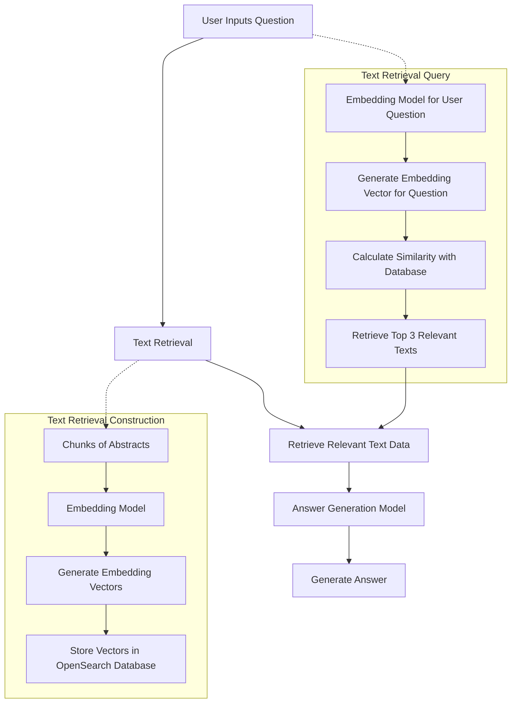

# QAsystem-NLPT
Natural Language Processing with Transformers Project

## Key Information
+ **Title:** QAsystem-NLPT (TBD)
  
+ **Team Members:** \
Guangdeng Liang, 3769325, Data and computer science (GitHub: Gorden-GitHub)\
Ye Tao, \
Yong Wu, \
Ziwei Liu

+ **Mail Addresses:**\
guangdeng.liang@stud.uni-heidelberg.de \

+ **Member Contribution:** 
  - Guangdeng Liang
    - text_retrieval, data preprocessing
  - Ye Tao 
  - Yong Wu 
  - Ziwei Liu

+ **Advisor:** \
Satya Almasian

+ **Anti-plagiarism Confirmation:** 

## Introduction

## Related Work

## Methods/Approach
### Data Acquisition
For the "Data Acquisition" phase of our project, we adhered closely to the guidelines provided in the project documentation regarding data selection. Our team elected to focus on PubMed as our primary source of data. Specifically, we targeted abstracts from articles published between 2013 and 2023 that include the term "intelligence" within the abstract text. This decision aligns with our project's domain of interest and sets a clear foundation for our research objectives.

To efficiently gather the required data, we utilized [Entrez Direct](https://www.ncbi.nlm.nih.gov/books/NBK179288/), a tool recommended by PubMed. Entrez Direct offers a command-line interface for accessing NCBI's comprehensive databases, allowing us to precisely retrieve the needed abstracts. This method ensures a streamlined and effective data collection process, pivotal for the success of our subsequent analyses.

### Workflow

### Chunking Methods
For effective processing and analysis of text data within our project, implementing an efficient chunking method is essential. One significant consideration is that some embedding models and answer generation models impose restrictions on the maximum number of input tokens they can handle. This limitation necessitates the division of text into smaller, manageable pieces or "chunks" to ensure compatibility with these models' input constraints. Chunking, therefore, becomes not just a matter of processing efficiency but also a fundamental requirement for the operational feasibility of our models.  

To address this, we have opted to utilize the `NLTKTextSplitter` from the `langchain.text_splitter` package, chosen for its robustness and its ability to accurately segment text based on natural language cues, ensuring that each chunk adheres to the models' input token limits while maintaining coherent and contextually meaningful segments of text. This splitter leverages the Natural Language Toolkit (NLTK), a leading platform for building Python programs to work with human language data, which provides powerful linguistic processing capabilities.

### Embedding Model
In our pursuit of a highly efficient and effective embedding model for our text processing pipeline, we carefully reviewed various options presented in the [rag.pdf](https://moodle.uni-heidelberg.de/pluginfile.php/1371515/mod_resource/content/2/rag.pdf), particularly focusing on the recommendations provided on [Hugging Face's MTEB leaderboard](https://huggingface.co/spaces/mteb/leaderboard). After thorough consideration, we decided to adopt the UAE-Large-V1 model as our primary embedding model.

Our selection of the UAE-Large-V1 model as the embedding model for our project was principally guided by its high ranking on Hugging Face's MTEB leaderboard. The leaderboard showcases a comprehensive evaluation of various models based on their performance across multiple text embedding benchmarks. The UAE-Large-V1 model's superior position indicates its exceptional capability in generating robust and versatile embeddings, making it a highly suitable choice for our project's intricate requirements in text retrieval and analysis. This empirical evidence of the model's effectiveness, as demonstrated in a competitive and diverse testing environment, solidified our decision to incorporate it into our text processing pipeline.

Given the specific nature of our project's domain, fine-tuning the UAE-Large-V1 model on our dataset is a crucial step. This process involves adjusting the model's parameters to better align with the semantic and contextual nuances of our collected text data, particularly the abstracts sourced from PubMed that contain the keyword "intelligence." Fine-tuning ensures that the model's embeddings are highly relevant and optimized for our text corpus, thereby enhancing the accuracy and relevance of the text retrieval and answer generation components of our system.

### vector database
For the storage, management, and retrieval of embedding vectors generated by the UAE-Large-V1 model, our team has chosen OpenSearch as our vector database solution. OpenSearch, a community-driven, open-source search and analytics suite, offers robust capabilities for handling large-scale vector data, making it an ideal choice for our project's needs.

## Experimental Setup and Results

## Conclusion and Future Work

## References
